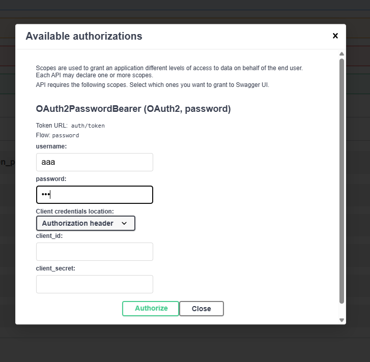

# Todos 
You need to have a pycharm project starting from this folder!

## Commands

Create the venv env
```shell
p3 -m pip install --upgrade pip
p3 -m venv fastapienv 
```

Activate
```shell
source fastapienv/bin/activate
```
Install the dependencies
```shell
pip install "fastapi[standard]"
pip install passlib
pip install bcrypt==4.0.1
pip install python-multipart
pip install "python-jose[cryptography]"
pip install sqlalchemy
```

### fastapi commands
```shell
uvicorn src.main:app --reload
```

### Generate random secret
```shell
openssl rand -hex 32
```
## sqllite

```shell
 sqlite3 todosapp.db
```

## Authentication

User `aaa/bbb` previously added in the db.



## Links
[jwt io](http://www.jwt.io)

### Change Password
Use this so you remember it: `12345!`